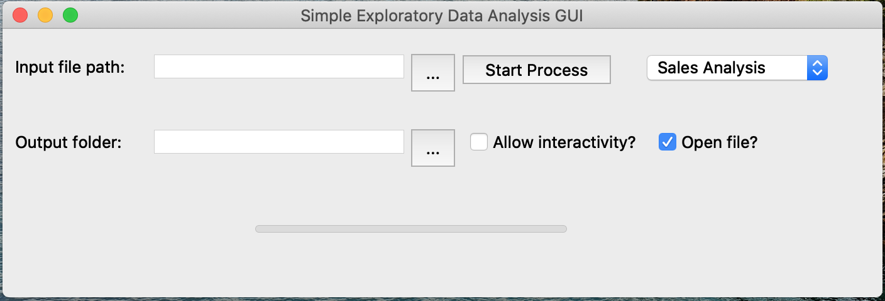

# Exploratory Data Analysis GUI (ExDAG)
A simple GUI that can be used as a platform for storing processes of analysis and visualisations. The GUI itself has a input box for data input/output and dropdown for selecting which process will be carried out.



Note: Works with MacOS and Windows

## Setup
1. Create a new python virtual env
```
conda create -n *testexdag* python=3.7.3 pyinstaller=3.6 pandas=0.25.3 numpy=1.17.3 matplotlib=3.1.2 seaborn=0.9.0
```
2. Then activate conda environment and install other requirements
```
conda activate *testexdag* 
pip install setuptools==28.8 pip install PyQt5==5.13.2 
```
3. Locate to the `.spec` file in the `exdag` folder and install the app using pyinstaller
```
cd exdag
pyinstaller --onefile exdag.spec
```
